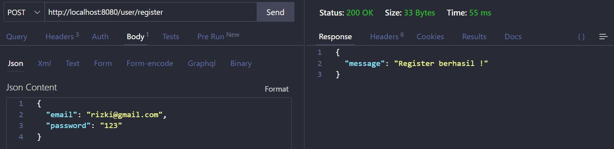
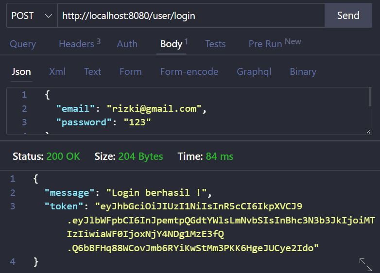
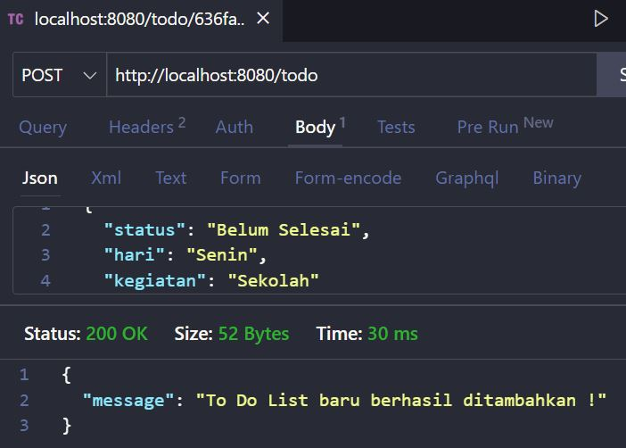
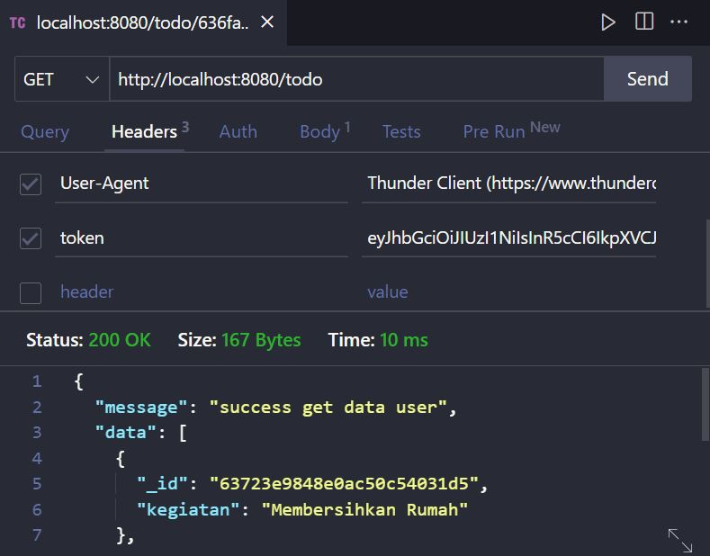
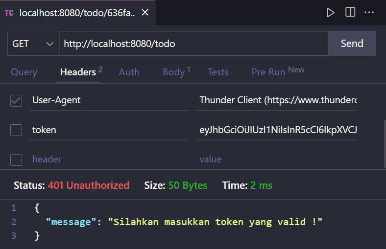
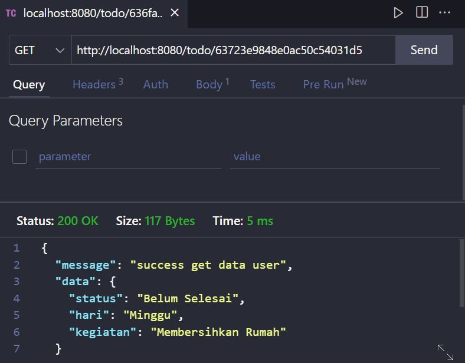
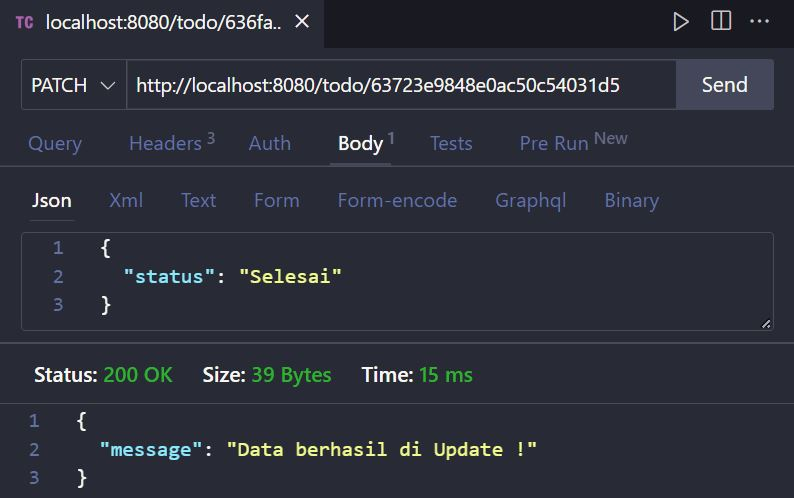
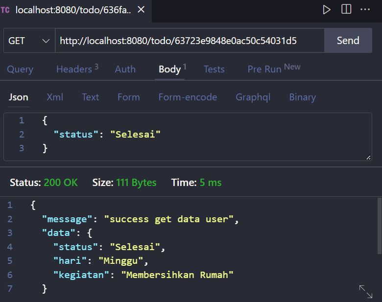
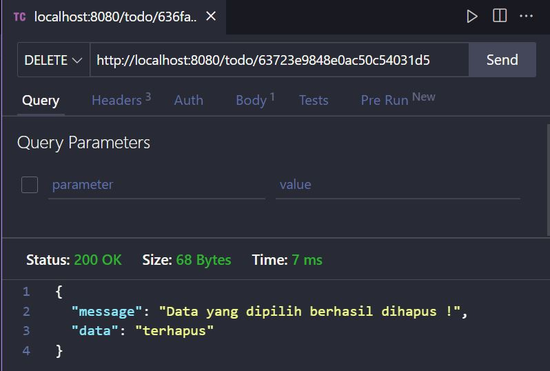
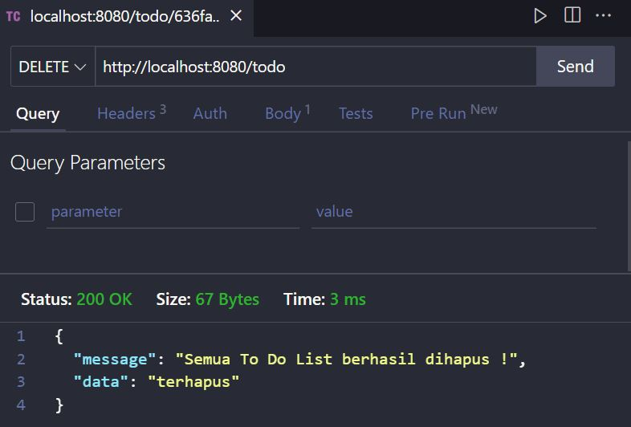

# Dokumentasi TPA-5

## A. _Syntax dari file yang digunakan_

- /config/db.js (koneksi pada database) :

```js
const mongoose = require("mongoose");

const db = mongoose.connect("mongodb://localhost:27017/tpa5");

module.exports = db;
```

- /controllers/todo.controller.js (file controller dari todo) :

```js
const Todo = require("../models/todo");
const User = require("../models/user");
const jwt = require("jsonwebtoken");

module.exports = {
  getAllToDo: async (req, res, next) => {
    const KEY = "ljksfjlkaslkjlkjf";
    const token = req.headers.token;

    if (token) {
      const verif = jwt.verify(token, KEY);

      User.findOne({ email: verif.email }).then((user) => {
        if (user) {
          req.verif = verif;
          next();
        }
      });
      try {
        const todo = await Todo.find({}, "-status -hari -__v");

        res.json({
          message: "success get data user",
          data: todo,
        });
      } catch (error) {
        console.log(error);
      }
    } else {
      res.status(401).json({
        message: "Silahkan masukkan token yang valid !",
      });
    }
  },

  getDetailToDo: async (req, res) => {
    try {
      const { id } = req.params;
      const todo = await Todo.findById(id, "-__v -_id");

      res.json({
        message: "success get data user",
        data: todo,
      });
    } catch (error) {
      console.log(error);
    }
  },

  addToDo: (req, res) => {
    const data = req.body;
    const todo = new Todo(data);

    todo.save();

    res.json({
      message: "To Do List baru berhasil ditambahkan !",
    });
  },

  updateToDo: async (req, res) => {
    const { id } = req.params;
    const data = req.body;

    const todo = await Todo.findByIdAndUpdate(id, data);

    await todo.save();

    res.json({
      message: "Data berhasil di Update !",
    });
    todo.save();
  },

  deleteToDo: async (req, res) => {
    const { id } = req.params;
    const todo = await Todo.findById(id);

    await todo.remove();
    res.json({
      message: "Data yang dipilih berhasil dihapus !",
      data: "terhapus",
    });
  },

  deleteAllToDo: async (req, res) => {
    try {
      await Todo.deleteMany({});

      res.json({
        message: "Semua To Do List berhasil dihapus !",
        data: "terhapus",
      });
    } catch (error) {
      console.log(error);
    }
  },
};
```

- /controllers/user.controller.js (File controller dari user) :

```js
const User = require("../models/user");
const bcrypt = require("bcrypt");
const jwt = require("jsonwebtoken");

module.exports = {
  getDataUser: async (req, res) => {
    try {
      const user = await User.find({}, "-password -__v");

      res.json({
        message: "success get data user",
        data: user,
      });
    } catch (error) {
      console.log(error);
    }
  },

  login: async (req, res) => {
    const data = req.body;
    const user = await User.findOne({ email: data.email });
    const KEY = "ljksfjlkaslkjlkjf";

    const cekLogin = bcrypt.compareSync(data.password, user.password);

    const token = jwt.sign(
      {
        email: data.email,
        password: data.password,
      },
      KEY
    );

    if (cekLogin) {
      res.json({
        message: "Login berhasil !",
        token,
      });
    } else {
      res.status(401).json({
        message: "Login gagal !",
      });
    }
  },

  register: (req, res) => {
    const data = req.body;

    const saltRounds = 10;
    const hash = bcrypt.hashSync(data.password, saltRounds);
    data.password = hash;

    const user = new User(data);

    user.save();

    res.json({
      message: "Register berhasil !",
    });
  },
};
```

- models/todo.js (File model dari todo) :

```js
const mongoose = require("mongoose");
const { Schema } = mongoose;

const todoSchema = new Schema({
  status: String,
  hari: String,
  kegiatan: String,
});

const Todo = mongoose.model("Todo", todoSchema);

module.exports = Todo;
```

- /models/user.js (File model dari user) :

```js
const mongoose = require("mongoose");
const { Schema } = mongoose;

const userSchema = new Schema({
  email: String,
  password: String,
});

const User = mongoose.model("User", userSchema);

module.exports = User;
```

- /routes/index.js (File utama dari semua router yang akan digunakan) :

```js
const express = require("express");
const router = express.Router();

const userRouter = require("./user.router");
const todoRouter = require("./todo.router");

router.use("/user", userRouter);
router.use("/todo", todoRouter);
module.exports = router;
```

- /routes/todo.router.js (File router dari todo yang akan dijalankan dengan file todo.controller.js) :

```js
const express = require("express");
const router = express.Router();

const { getAllToDo, getDetailToDo, addToDo, updateToDo, deleteToDo, deleteAllToDo } = require("../controllers/todo.controller");

router.get("/", getAllToDo);
router.get("/:id", getDetailToDo);
router.post("/", addToDo);
router.patch("/:id", updateToDo);
router.delete("/:id", deleteToDo);
router.delete("/", deleteAllToDo);

module.exports = router;
```

- /routes/user.router.js (File router dari user yang akan dijalankan dengan file user.controller.js) :

```js
const express = require("express");
const router = express.Router();

const { login, register, getDataUser } = require("../controllers/user.controller");

router.get("/", getDataUser);
router.post("/login", login);
router.post("/register", register);

module.exports = router;
```

- app.js (File utama untuk mengkoneksikan dengan port serta tes apakah kita sudah berhasil terhubung dengan database atau belum) :

```js
const express = require("express");
const app = express();
const db = require("./config/db");

const allRoutes = require("./routes");

const PORT = 8080;

db.then(() => {
  console.log("berhasil terhubung ke database !");
}).catch((err) => {
  console.log(err);
});

app.use(express.json());
app.use(allRoutes);

app.listen(PORT, () => {
  console.log("Server berjalan pada port " + PORT);
});
```

## B. _Fitur Setiap Endpoint_

- Register user (dengan method POST dan hashing password) :

  ```js
  router.post("/register", register);
  ```

  ```js
  register: (req, res) => {
  const data = req.body;

  const saltRounds = 10;
  const hash = bcrypt.hashSync(data.password, saltRounds);
  data.password = hash;

  const user = new User(data);

  user.save();

  res.json({
    message: "Register berhasil !",
  });
  },
  ```

  - Contoh dalam bentuk gambar :

    

- Login sekaligus memberikan token (Authentication) untuk proses Authorization pada Todo (method POST) :

  ```js
  router.post("/login", login);
  ```

  ```js
    login: async (req, res) => {
  const data = req.body;
  const user = await User.findOne({ email: data.email });
  const KEY = "ljksfjlkaslkjlkjf";

  const cekLogin = bcrypt.compareSync(data.password, user.password);

  const token = jwt.sign(
    {
      email: data.email,
      password: data.password,
    },
    KEY
  );

  if (cekLogin) {
    res.json({
      message: "Login berhasil !",
      token,
    });
  } else {
    res.status(401).json({
      message: "Login gagal !",
    });
  }
  },
  ```

  - Contoh dalam bentuk gambar (login sekaligus memberikan token yang akan digunakan pada proses authorization) :

    

- Membuat sebuah Todo baru (method POST) :

  ```js
  router.post("/", addToDo);
  ```

  ```js
  addToDo: (req, res) => {
  const data = req.body;
  const todo = new Todo(data);

  todo.save();

  res.json({
    message: "To Do List baru berhasil ditambahkan !",
  });
  },
  ```

  - Contoh dalam bentuk gambar :

    

- Melihat semua list Todo yang telah dibuat serta mengaplikasikan contoh proses Authorization dari token yang sudah kita buat pada fitur login. Ketika user belum login dan tidak punya token maka tidak akan bisa mengakses / melihat semua Todo list yang sudah dibuat (method GET) :

  ```js
  router.get("/", getAllToDo);
  ```

  ```js
  getAllToDo: async (req, res, next) => {
  const KEY = "ljksfjlkaslkjlkjf";
  const token = req.headers.token

  if (token) {
    const verif = jwt.verify(token, KEY)

     User.findOne({email: verif.email})
    .then(user => {
      if(user) {
        req.verif = verif
        next()
      }
    })
    try {
      const todo = await Todo.find({}, "-status -hari -__v");

      res.json({
        message: "success get data user",
        data: todo,
      });
    } catch (error) {
      console.log(error);
    }
  } else {
    res.status(401).json({
      message: "Silahkan masukkan token yang valid !"
    })
  }
    },
  ```

  - Contoh dalam bentuk gambar :

    

      - lalu token yang terdapat pada gambar di atas digunakan pada saat akan melihat list semua todo

  

      - Ketika tidak memakai token, maka output akan menjadi seperti :

  

- Melihat detail Todo (disini saya membuat detail dari Todo ketika kita mengakses salah satu Todo berdasarkan dengan id, method GET) :

  ```js
  router.get("/:id", getDetailToDo);
  ```

  ```js
    getDetailToDo: async (req, res) => {
    try {
      const { id } = req.params;
      const todo = await Todo.findById(id, "-__v -_id");

      res.json({
        message: "success get data user",
        data: todo,
      });
    } catch (error) {
      console.log(error);
    }
  },
  ```

  - Contoh dalam bentuk gambar :

    

- Mengubah Todo dimana melakukan update berdasarkan id dari Todo yang sudah dibuat(method PATCH) :

  ```js
  router.patch("/:id", updateToDo);
  ```

  ```js
  updateToDo: async (req, res) => {
  const { id } = req.params;
  const data = req.body

  const todo = await Todo.findByIdAndUpdate(id, data);

  await todo.save()

  res.json({
    message: "Data berhasil di Update !",
  });
  todo.save();
  },
  ```

  - Contoh dalam bentuk gambar :

    - Sebelum di Update :

      

    - Proses Update :

      

    - Sesudah di Update :

      

- Menghapus Todo berdasarkan ID Todo yang sudah dibuat (method DELETE) :

  ```js
  router.delete("/:id", deleteToDo);
  ```

  ```js
  deleteToDo: async (req, res) => {
  const { id } = req.params;
  const todo = await Todo.findById(id);

  await todo.remove();
  res.json({
    message: "Data yang dipilih berhasil dihapus !",
    data: "terhapus",
  });
  },
  ```

  - Contoh dalam bentuk gambar :

    

- Menghapus semua Todo yang sudah dibuat (method DELETE) :

  ```js
  router.delete("/", deleteAllToDo);
  ```

  ```js
    deleteAllToDo: async (req, res) => {
    try {
      await Todo.deleteMany({});

      res.json({
        message: "Semua To Do List berhasil dihapus !",
        data: "terhapus",
      });
    } catch (error) {
      console.log(error);
    }
  },
  ```

  - Contoh dalam bentuk gambar :

    
